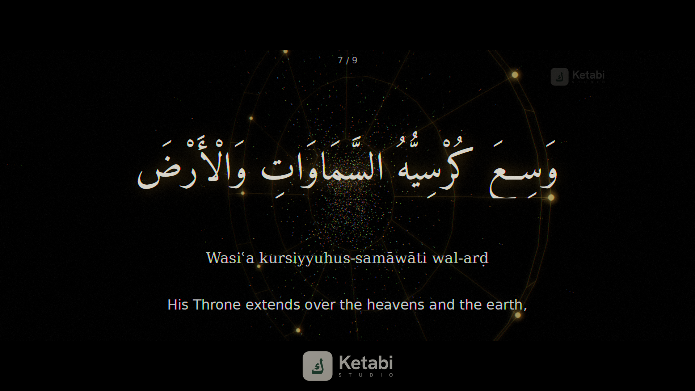

# Video_maker

Render **Ayat al-Kursi** (Surah Al-Baqarah, 2:255 — "The Verse of the Throne")
as a video. Two renderers are included:

| Renderer | Look | Command |
| --- | --- | --- |
| **Cinematic 3-D** *(flagship)* | A camera flight through a volumetric golden star/dust field, a rotating 3-D ornamental medallion (concentric rings + spokes, rose-window / astrolabe style), word-by-word kinetic reveals, a faint Ketabi Studio brand watermark, HDR bloom, anamorphic 2.39:1 letterbox, chromatic aberration, vignette and film grain. | `python3 src/cinematic.py` |
| **Classic cards** | Clean phrase-by-phrase cards with a gradient background and gold ornaments. | `python3 src/render.py` |



The verse is revealed phrase by phrase — Arabic in the **AmiriQuran** script, a
transliteration, and the English meaning — then the complete verse appears over
the glowing emblem before everything converges to a single point of light.

## Quick start

```bash
bash scripts/setup.sh                 # install deps + fonts (one time)
python3 src/cinematic.py              # -> output/ayat_al_kursi_cinematic.mp4
```

## Cinematic renderer

```bash
python3 src/cinematic.py [options]

  --out PATH        output file (default: output/ayat_al_kursi_cinematic.mp4)
  --width  N        frame width  (default: 1920)
  --height N        frame height (default: 1080)
  --fps N           frames per second (default: 30)
  --preview         render only title + a verse + the climax + finale (fast check)
  --poster          save a single representative PNG and exit
  --seconds-cap N   stop after N seconds (useful for tests)
```

Examples:

```bash
# quick low-res motion check
python3 src/cinematic.py --preview --width 960 --height 540 --fps 24

# vertical 9:16 cut for reels/shorts
python3 src/cinematic.py --width 1080 --height 1920 --out output/ayat_vertical.mp4
```

## How the 3-D works

There is **no GPU, Blender or system ffmpeg** in play — it is a small, fully
**vectorised software 3-D engine** in numpy:

- **Perspective fly-through.** Particles live in a 3-D frustum; their screen
  position is `centre + (u, v) · scale / z`, so as the camera advances (`z`
  shrinks) they sweep radially outward — a genuine 3-D dolly. Particles that
  pass the camera are recycled to the far plane for an endless field, and are
  drawn with motion streaks during warp accelerations.
- **Rotating medallion.** A round ornamental medallion (concentric rings joined
  by radial spokes — a rose-window / astrolabe motif, deliberately circular with
  no pointed-star geometry) is rotated with real 3×3 rotation matrices and
  perspective-projected each frame, then drawn as a glowing line figure (sharp
  core + blurred halo).
- **Brand watermark.** The Ketabi Studio wordmark is composited after grading —
  a premium placement in the lower cinematic bar plus a faint, slowly drifting
  anti-theft guard mark in a corner. Brand assets live in `assets/brand/`.
- **Text shaping.** Pillow + **libraqm/HarfBuzz** do full Arabic cursive joining
  and bidi directly from logical-order text (with an `arabic-reshaper` +
  `python-bidi` fallback).
- **Cinematic finishing.** Everything is composited into an HDR float buffer,
  then put through filmic tone-mapping, HDR bloom, chromatic aberration,
  vignette, film grain and 2.39:1 letterbox bars before being piped to a bundled
  `ffmpeg` (via `imageio-ffmpeg`) and encoded to H.264.

## Project layout

```
src/verse.py      the verse text: Arabic, transliteration, translation
src/cinematic.py  the 3-D engine, scenes, post-processing and encoding
src/render.py     the classic card renderer
assets/fonts/     AmiriQuran (Quranic Arabic) + DejaVu (Latin)
scripts/setup.sh  installs dependencies and fonts
output/           rendered videos + posters
```

## Fonts & licensing

- **Amiri / AmiriQuran** — © The Amiri Project, [SIL Open Font License 1.1](https://github.com/aliftype/amiri).
- **DejaVu Sans/Serif** — DejaVu Fonts license (public-domain derived).
